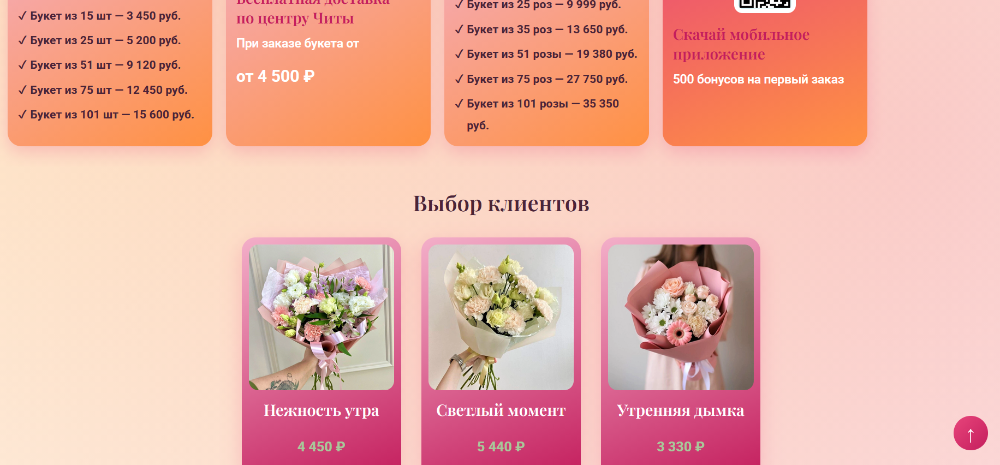

<div align="center">

# 🌸 ЗабБукет.ru

### Лендинг цветочного магазина

**[🔗 Открыть сайт в браузере](https://n0vaira.github.io/my_flower_site_/)**

</div>

---
## 📸 Скриншоты
**Главный экран**
<div align="center">
  
</div>
**Каталог с категориями**
<div align="center">
  
</div>
## 📖 О проекте

Это сайт цветочного магазина, созданный в рамках учебной практики. Здесь продумано всё для удобства клиентов: первый экран с красивым оффером, каталог товаров, блок с акциями, отзывы, условия доставки и удобные интерактивные модальные окна. Сайт отлично смотрится как на компьютере, так и в телефоне.

## ✨ Возможности сайта

- 📱 Адаптивная вёрстка — одинаково удобно и на телефоне, и на компьютере
- 🗂 Каталог с категориями букетов
- 🎁 Блок с акциями и спецпредложениями
- 📝 Формы заказа, сбора индивидуального букета и обратной связи — с проверкой полей и уведомлением об успешной отправке
- 🪟 Всплывающие окна («О нас», оформление заказа, сбор букета)
- ⬆️ Плавающая кнопка «Наверх»
- 💬 Отзывы клиентов
- 🔗 Ссылки на соцсети и мобильное приложение

## 🛠 Технологии

| Технология | Для чего использована |
|---|---|
| **HTML5** | разметка страницы |
| **CSS3** | CSS-переменные для цветовой палитры, адаптивные медиа-запросы |
| **JavaScript** | формы, модальные окна, кнопка «Наверх» — без сторонних библиотек |

### Шрифты

Сайт использует два шрифта из Google Fonts:
- **Playfair Display** — для заголовков, создаёт «цветочный», элегантный акцент
- **Roboto** — для основного текста, простой и хорошо читаемый

## 📁 Структура проекта

```
my_flower_site_/
├── index.html      — разметка страницы
├── style.css       — стили
├── script.js       — интерактивность
├── images/         — картинки и иконки сайта
└── README.md
```

## 🚀 Как запустить у себя

1. Скачай файлы репозитория (**Code → Download ZIP**) и распакуй в любую папку
2. Открой папку в VS Code
3. Запусти `index.html` через расширение **Live Server** — сайт откроется в браузере со всеми правильными путями к картинкам

## 🗺 Планы по развитию

- [ ] Подключить отправку заявок с форм на почту, чтобы заказы реально доходили
- [ ] Сжать изображения и перевести в формат WebP — страница будет загружаться быстрее
